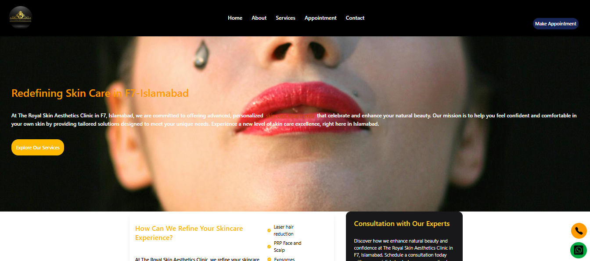
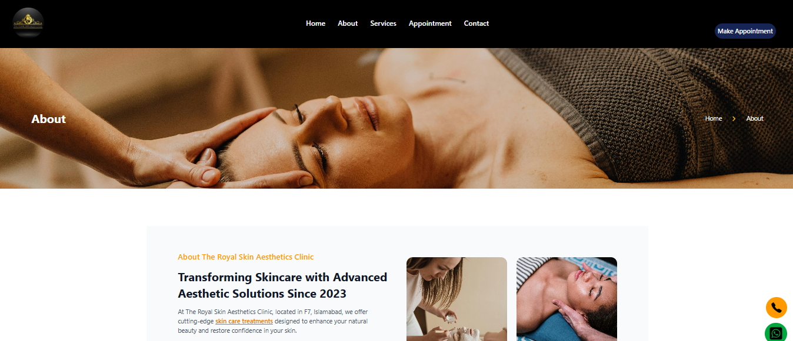
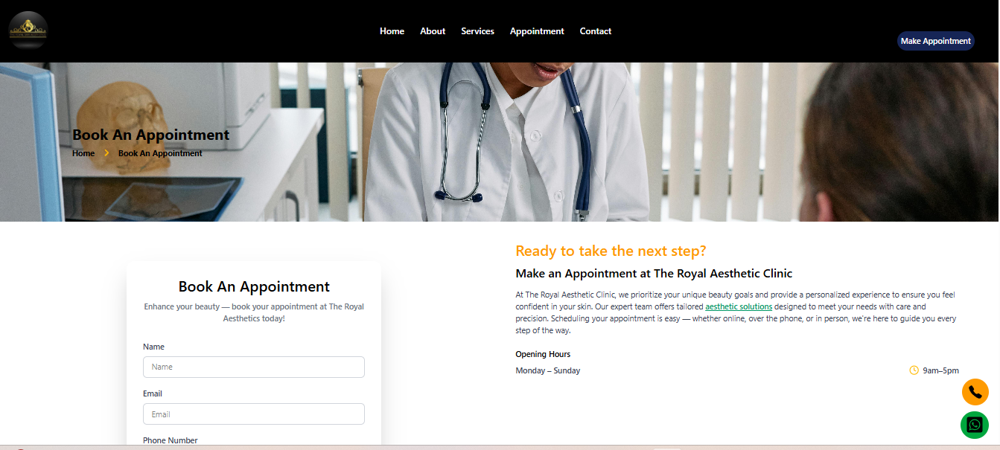
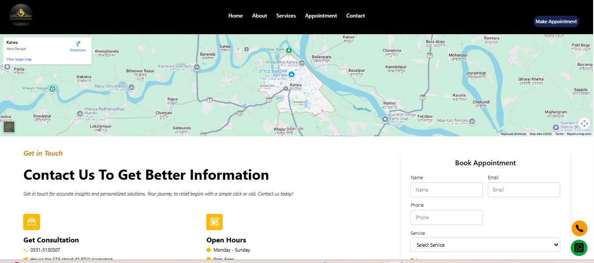
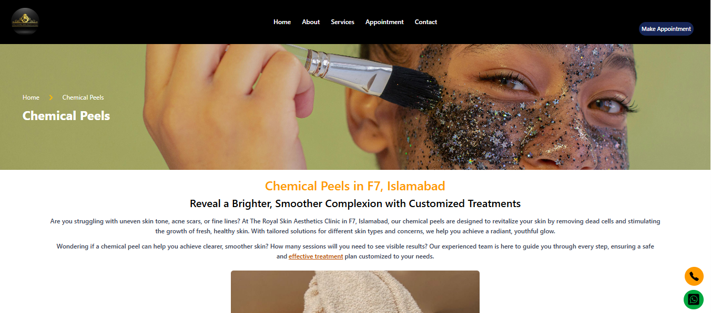

🔗 Live Demo:
[View Live Website](https://skin-treatment-frontend.vercel.app/)

📌 Portfolio Description 

SkinCare Pro is a fully responsive, production-ready frontend web application developed for a modern dermatology and aesthetic clinic.

The project demonstrates strong skills in:

🔹Component-based architecture using React

🔹Advanced routing with React Router

🔹Responsive UI design using Tailwind CSS

🔹Animation integration using Framer Motion

🔹Scalable folder structure for real-world applications

🔹Clean and maintainable code practices

🔹This project reflects my ability to build professional, client-ready healthcare websites with performance, scalability, and user experience in mind.

🚀 Project Overview

SkinCare Pro is a Single Page Application (SPA) designed to showcase advanced cosmetic and dermatology treatments including:

🔹Laser Treatments

🔹Botox

🔹PRP Therapy

🔹Dermal Fillers

🔹Hydrafacial

🔹Fat Reduction

🔹HIFU

🔹Thread Lift

🔹Chemical Peels

🔹And many more

🔹Each service has a dedicated page with detailed information, creating a real-world clinic experience.

✨ Key Features

🔹Fully responsive design (Mobile, Tablet, Desktop)

🔹Modern UI with Tailwind CSS

🔹Smooth navigation using React Router

🔹Individual service detail pages

🔹Appointment booking section

🔹Contact page

🔹Scroll-to-top functionality

🔹Smooth animations (Framer Motion)

🔹Interactive sliders (Swiper)

🔹Clean, scalable component architecture

🛠️ Technology Stack

🔹React 19

🔹Vite

🔹React Router DOM

🔹Tailwind CSS

🔹Framer Motion

🔹Swiper.js

🔹React Icons

🔹ESLint

📂 Project Architecture
src/
│
├── assets/
├── component/
│   ├── Layout Components (Navbar, Footer)
│   ├── Core Sections (Hero, About, Services)
│   ├── Appointment & Contact
│   └── Individual Treatment Pages
│
├── App.jsx (Routing Configuration)
├── main.jsx (Application Entry)
└── Styles

The project follows a modular and reusable component structure, making it scalable for future backend integration.

🖼️ Screenshots

⚙️ Installation & Setup
1️⃣ Clone the repository
git clone (https://github.com/sayantinimukherjee79/SkinTreatmentFrontend).git
2️⃣ Navigate into the project
cd skintreatment
3️⃣ Install dependencies
npm install
4️⃣ Run development server
npm run dev

App will run at:

http://localhost:5173/
📦 Production Build

To generate production files:

🔹npm run build

To preview production build:

🔹npm run preview

Deploy the generated dist/ folder to:

🔹Vercel

🔹Netlify

🔹GitHub Pages

🔹Any static hosting platform

📈 Future Enhancements

🔹 Secure database integration (MongoDB / Firebase Firestore) for storing and managing appointment records

🔹 Admin dashboard with analytics to manage bookings, services, and patient inquiries

🔹 Role-based authentication system (Admin / Staff) with secure login and protected routes

🔹 Email integration for appointment confirmations and notifications (Nodemailer / Firebase Functions)

🔹 SMS notification system for booking confirmations and reminders (Twilio integration)

🔹 SEO optimization including meta tags, structured data, sitemap, and Open Graph support

🔹 Performance optimization targeting Lighthouse score 95+ (image optimization, lazy loading, code splitting, caching)

🔹 Form validation with real-time error handling and secure submission

🔹 Deployment with CI/CD pipeline for automated builds and updates

🎯 What This Project Demonstrates

✔ Ability to build scalable React applications
✔ Clean UI/UX implementation
✔ Modern frontend tooling (Vite + Tailwind)
✔ Routing architecture
✔ Component reusability
✔ Production-level folder structuring

👨‍💻 Developer

Sayantini Mukherjee
Frontend Developer | React Enthusiast

If you are a recruiter or hiring manager, feel free to connect with me for collaboration or opportunities.

📄 License

This project is created for educational and portfolio purposes.
